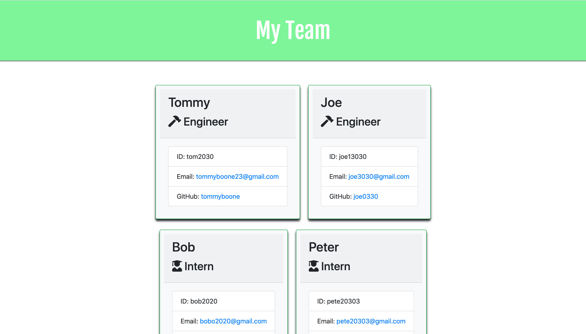

# Template_Engine-Employee_Summary

# User Story

As a manager
I want to generate a webpage that displays my team's basic info
so that I have quick access to emails and GitHub profiles

# Minimum Requirements

Functional application.

GitHub repository with a unique name and a README describing the project.

User can use the CLI to generate an HTML page that displays information about their team.

All tests must pass.

# Screenshot

# GIF Demo node app.js

# GIF Demo Run-Test

